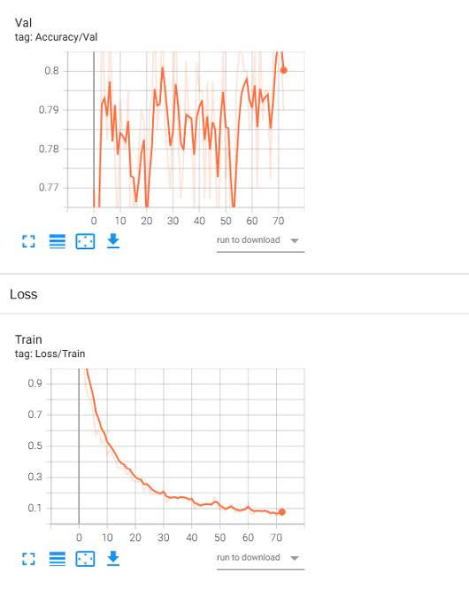
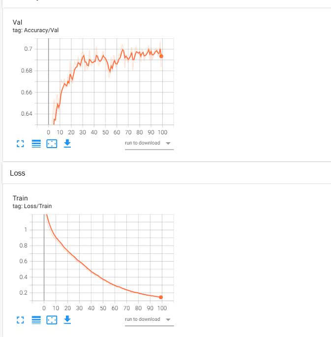
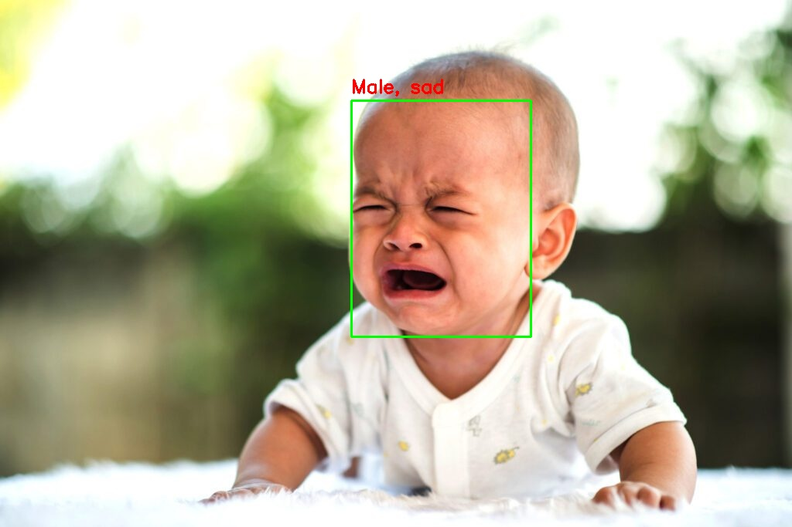

# Project-detect-meotion-gender :

Project face detection and emotion/gender classification using 3 datasets with a Resnet model and Yolo.

* WIDER FACE for YOLO training : https://www.kaggle.com/datasets/lylmsc/wider-face-for-yolo-training?utm\_source=chatgpt.com
* FER-2013 for emotion training : https://www.kaggle.com/datasets/msambare/fer2013
* Gender Classification Dataset for emotion training : https://www.kaggle.com/datasets/cashutosh/gender-classification-dataset

# Emotion/gender losses:

  <b>Loss function of Emotion</b> 
  

  <b>Loss function of Gender</b> 
  

# Output :

  

[Video demo](test/output/result_video.mp4)
